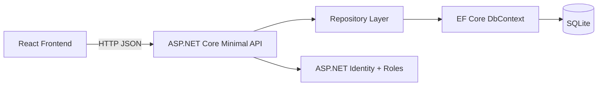
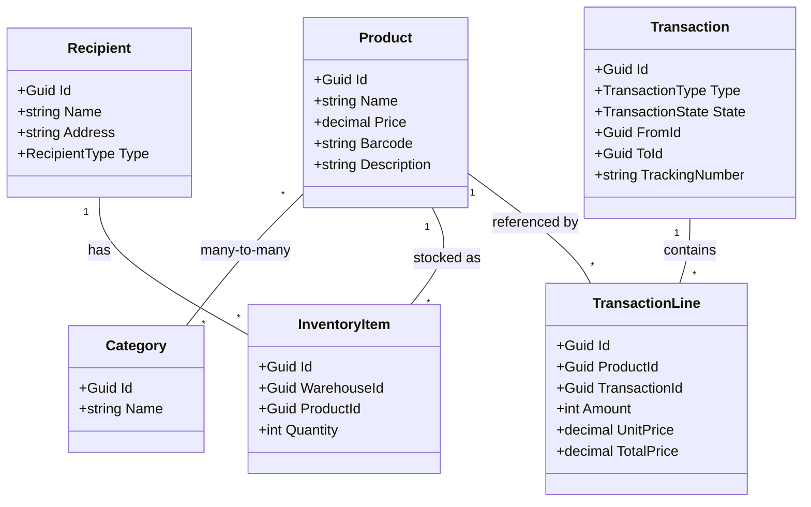

# StockFlow Warehouse

StockFlow is a simple full-stack warehouse management system:

- ASP.NET Core Web API backend
- React + Vite frontend
- SQLite with Entity Framework Core

It supports product management, warehouse inventory viewing, order creation with stock reservation, and role-based authorization.

---

## 1) Requirements

- .NET SDK 10
- Node.js 20+
- npm 10+
- Docker Desktop (optional)

---

## 2) Quick start

### Option A: Run with Docker

From repo root:

1. `docker compose up --build`
2. Open frontend: `http://localhost:5173`
3. API should be available on: `http://localhost:5212`

Stop containers:

- `docker compose down`

### Option B: Run without Docker

Open two terminals from repo root.

Terminal 1 (backend):

1. `dotnet restore`
2. `dotnet run --project StockFlow-Warehouse/StockFlow-Warehouse.csproj`

Terminal 2 (frontend):

1. `cd StockFlow-Warehouse-frontend`
2. `npm install`
3. `npm run dev -- --host`

Open: `http://localhost:5173`

---

## 3) Local run details (without Docker)

### Backend

From repo root:

1. `dotnet restore`
2. `dotnet run --project StockFlow-Warehouse/StockFlow-Warehouse.csproj`

Backend default URL: `http://localhost:5212`

### Frontend

In a second terminal:

1. `cd StockFlow-Warehouse-frontend`
2. `npm install`
3. `npm run dev -- --host`

Frontend default URL: `http://localhost:5173`

Using `--host` makes it available on your local network for mobile testing.

---

## 4) Mobile test on same Wi-Fi

1. Make sure your phone and PC are on the same Wi-Fi.
2. Start the app with either Docker or non-Docker quick start.
3. Find your PC IPv4 address (Windows): `ipconfig`.
4. Open on phone: `http://<YOUR_PC_IP>:5173`

If your phone cannot connect, allow Node/Vite and .NET through Windows Firewall.

---

## 5) Authentication and demo users

Identity endpoints are enabled by backend startup (`/register`, `/login`, `/logout`).

Seeded demo users:

- Admin: `admin@stockflow.local` / `Admin123!`
- Manager: `manager@stockflow.local` / `Manager123!`
- Employee: `employee@stockflow.local` / `Employee123!`

Role policy used for write actions:

- `ManagerOrAdmin`

Meaning:

- Employee can read data
- Manager/Admin can create, update, delete protected resources

---

## 6) Main features

- Product CRUD (with validation)
- Product filtering/sorting by name and price range
- Warehouse status UI with inventory list and low-stock highlighting
- Orders page with line items and stock reservation
- Role-based authorization on write endpoints

---

## 7) API overview (selected)

### Products

- `GET /api/products`
- `GET /api/products/{id}`
- `POST /api/products` (Manager/Admin)
- `PUT /api/products/{id}` (Manager/Admin)
- `DELETE /api/products/{id}` (Manager/Admin)

### Warehouses

- `GET /api/warehouses`
- `GET /api/warehouses/{id}`

### Transactions / Orders

- `GET /api/transactions` (authenticated)
- `GET /api/transactions/orders`
- `POST /api/transactions/orders` (Manager/Admin)
- `DELETE /api/transactions/{id}` (Manager/Admin)

---

## 8) Architecture (high-level)

---

## 9) Domain model (simplified)

---

## 10) Design choices and patterns

- **Repository pattern** for product/warehouse data access
- **DTO/request records** for API input validation
- **Policy-based authorization** for role checks
- **Thin frontend API client** (`getJson`, `postJson`, `putJson`, `deleteJson`)

---

## 11) Testing

Test project: `TestWarehouse`

Run tests:

- `dotnet test`

Current tests focus mainly on repository behavior. Next recommended tests are API/authorization integration tests.

---

## 12) Public deploy (optional)

If you need a public link without Docker:

1. Deploy backend to Render as a .NET Web Service.
2. Deploy frontend to Vercel.
3. Set frontend API base URL to your Render backend URL.
4. Ensure CORS allows your Vercel domain.

---

## 13) Known development note

In development, startup currently deletes and recreates DB (`EnsureDeletedAsync()`), so data resets on restart.

